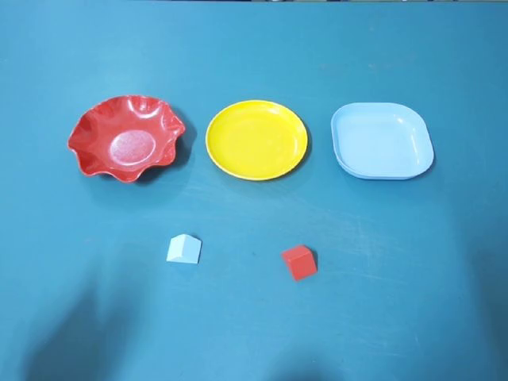

# Wall-X

<div align="left">

<!-- Links -->
<a href="https://huggingface.co/x-square-robot">
  
</a>
<a href="https://x2robot.com/en/research/68bc2cde8497d7f238dde690">
  
</a>

<!-- Tech stack -->
<br/>


</div>

## Building General-Purpose Robots Based on Embodied Foundation Model
We are building the embodied foundation model to capture and compress the world's most valuable data: the continuous, high-fidelity stream of physical interaction.

By creating a direct feedback loop between the model's decisions and the body's lived experience, we enable the emergence of a truly generalizable intelligence—one that understands not just how the world works, but how to act effectively within it.

## Repository
This repository provides the training and inference code that supports our WALL series open-source embodied foundation models. It includes end-to-end pipelines for data preparation (LeRobot), model configuration, flow-matching and FAST action branches, and evaluation utilities for real and simulated robots.

## News
- We introduce [**WALL-OSS: Igniting VLMs toward the Embodied Space**](https://x2robot.com/en/research/68bc2cde8497d7f238dde690), an end-to-end embodied foundation model that leverages large-scale multimodal pretraining to achieve (1) embodiment-aware vision–language understanding, (2) strong language–action association, and (3) robust manipulation capability.

## Models
- WALL-OSS-FLOW: https://huggingface.co/x-square-robot/wall-oss-flow
- WALL-OSS-FAST: https://huggingface.co/x-square-robot/wall-oss-fast

## Environment Setup

Create and activate conda environment:
```bash
conda create --name wallx python=3.10
conda activate wallx
```

Install requirements:
```bash
pip install -r requirements.txt
MAX_JOBS=4 pip install flash-attn==2.7.4.post1 --no-build-isolation
```

Install lerobot:
```bash
git clone https://github.com/huggingface/lerobot.git
cd lerobot
pip install -e .
```

Install wall_x:
```bash
git submodule update --init --recursive
MAX_JOBS=4 pip install --no-build-isolation --verbose .
```

## Training

### Finetune on LeRobot Datasets

Before training, please refer to `workspace/README.md` for detailed configuration instructions including:

Training script path configuration

- GPU setup
- Model and data paths
- Robot DOF configuration
- Training hyperparameters

Download the Flow/FAST pretrained model and run:
```bash
bash ./workspace/lerobot_example/run.sh
```

## Inference

### Basic Action Inference

For model inference, please refer to:

```bash
python ./scripts/fake_inference.py
```

This script demonstrates how to:
- Load the Wall-OSS model using `Qwen2_5_VLMoEForAction.from_pretrained()`
- Prepare input data including proprioceptive information, attention masks, and dataset specifications
- Run inference in validation mode with proper data types (bfloat16)
- Validate model outputs and check for numerical stability

### Open-Loop Evaluation

To generate an open-loop comparison plot, please follow:

```bash
python ./scripts/draw_openloop_plot.py
```

### VQA Inference and Chain-of-Thought Testing

To run VQA inference and test the model's Chain-of-Thought (COT) reasoning capabilities, please follow:

```bash
python ./scripts/vqa_inference.py
```

This script can be used to test the model's COT reasoning abilities for embodied tasks. Below is an example of COT testing:

**Input Image:**



**Input Text:**
```
To move the red block in the plate with same color, what should you do next? Think step by step.
```

**Model Output (COT Reasoning):**
```
To move the red block in the plate with the same color, you should first locate the red block. It is currently positioned on the table, not in the plate. Then, you should carefully grasp the red block using your fingers. Next, you should use your hand to lift the red block from the table and place it into the plate that is also red in color. Ensure that the red block is securely placed in the plate without slipping or falling.
```

## 📚 Cite Us

If you find WALL-OSS models useful, please cite:

```bibtex
@article{zhai2025igniting,
  title   = {Igniting VLMs Toward the Embodied Space},
  author  = {Zhai, Andy and Liu, Brae and Fang, Bruno and Cai, Chalse and Ma, Ellie and Yin, Ethan and Wang, Hao and Zhou, Hugo and Wang, James and Shi, Lights and Liang, Lucy and Wang, Make and Wang, Qian and Gan, Roy and Yu, Ryan and Li, Shalfun and Liu, Starrick and Chen, Sylas and Chen, Vincent and Xu, Zach},
  journal = {arXiv preprint arXiv:2509.11766},
  year    = {2025}
}
```
